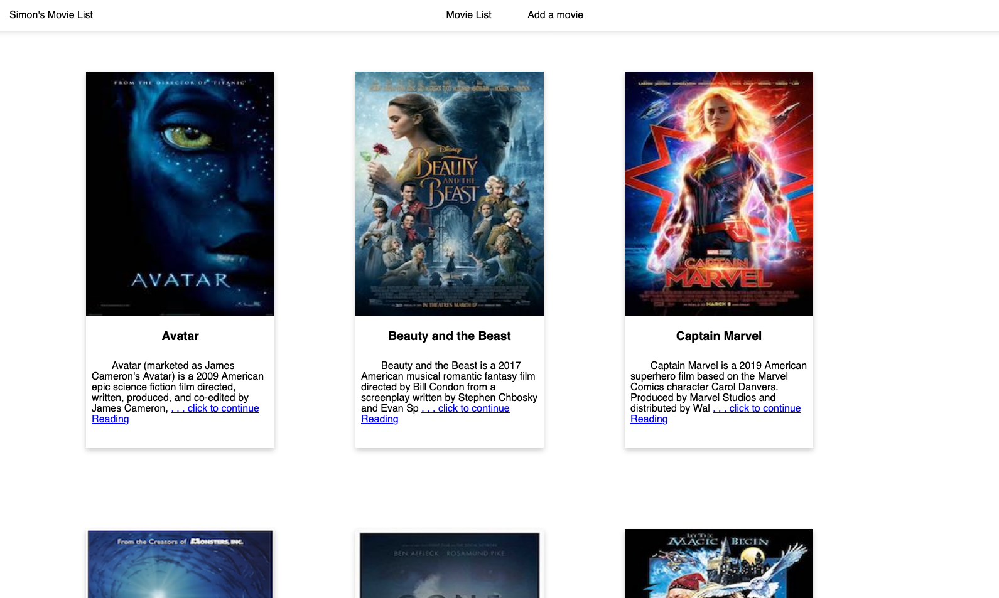
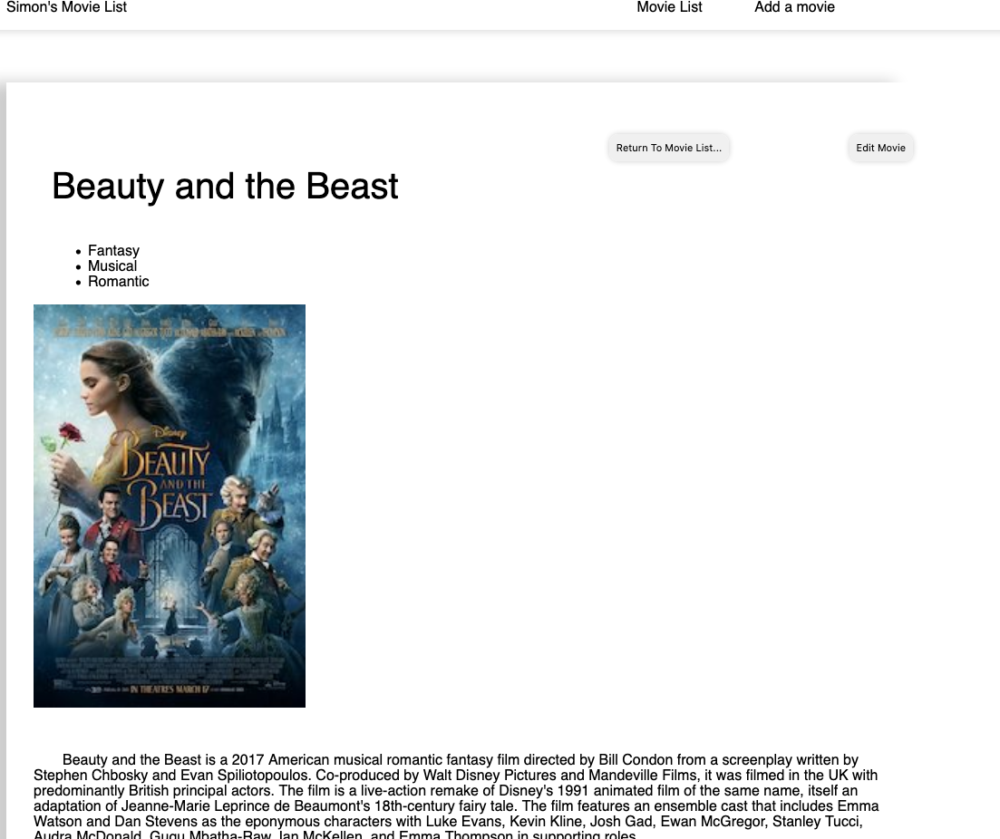
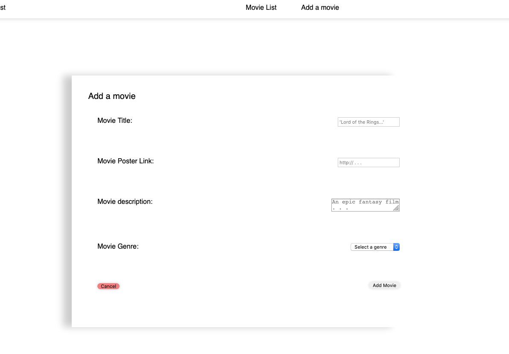

# Movie Sagas Project

## Description
__Duration: weekend Assignemnt

Movies Sagas is a project focussed on applying lessons learned on Redux, and Redux Sagas. This project also require the use of relational SQL tables making routing for Express more tricky. 
This project was a lot of fun to put together, and I focused a lot on making the page look like a real site. I learned a lot about how Sags work, and interact with the client. 

## Images

Home Page: 
    
Movie Details Page: 
    
Add Movie Page:
    

## Prerequisites
    * Node.js
    * postgresql (postico)

## Installation
    1. fork/clone or download a zip of the repo
    2. from inside the downloaded directory ( in terminal ), run `npm install` to install all dependecies
    3. in Postico (PSQL), run the database.sql file to import some test data. 
    4. run `npm run server` in a terminal 
    5. run `npm run client` in a terminal ( this will open a browser window to view the app)
## Usage
    * you can view a list of all movies in the database from the home page
    * selecting a movie will bring you to a details page with more info about the given movie
    * you can edit the movie from this page by selecting 'edit movie'
    * selecting "add movie" in the nav bar will allow you to add a new movie to the database.

## Built With
    * React
        *  Redux //  React-Redux
        * React-Router-Dom
        * Sagas
        * Axios
    * Postgresql (PG)
## Acknowledgement 
    Thanks to the instructors and team at Prime Digital Academy who have been helped me forge this app into reality. Also thanks to my awesome cohort Ukkonen at Prime for support and teamwork!! 

